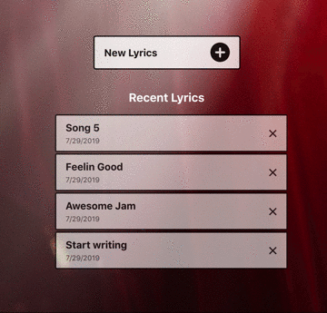
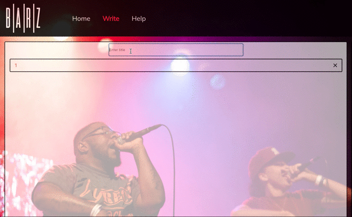
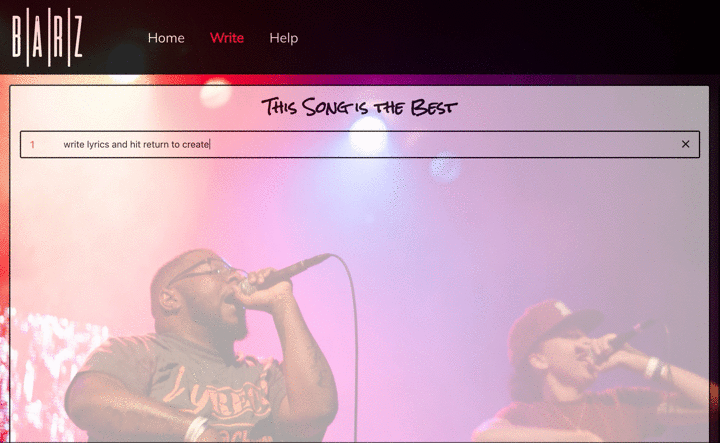
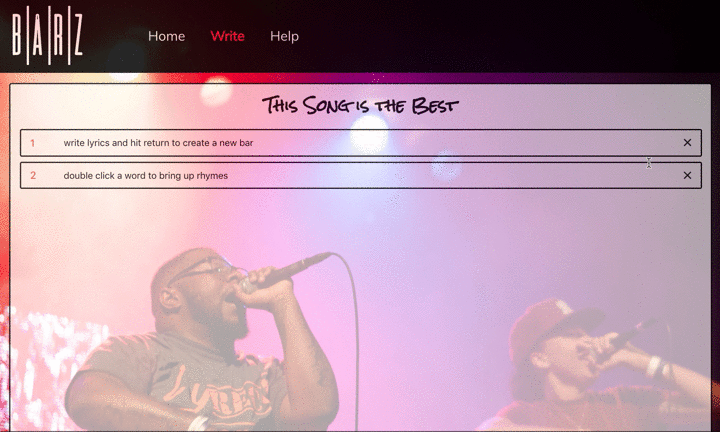
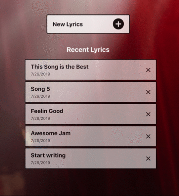

# Barz

Barz is a web app aimed to solve a niche problem with a simple solution. Musicians (specifically rappers) almost exclusively write lyrics using Google Docs, Notes, or another basic text-editor of choice. This allows them to quickly jot down lyrics as they come to mind, and gives them an easy way to read them while recording.

Barz solves a few major hiccups in that workflow:

- Lyrics are written in bar notation, so the artist can easily track what measure they are on without playing back the music multiple times.

- Any word can be selected to show a list of rhymes. This saves the artist from having to visit another webpage which can distract from the job at hand.

### UI

## Technology used

- React
- Redux
- Javascript
- Scss
- DataMuse API
- Enzyme/Jest
- PropTypes

## Installation

Clone the repo - `https://github.com/rumizen/barz-redux`

Run `npm install` from the root directory

Run `npm start` and visit `localhost:3000` in your browser

## Contributing

Pull requests are welcome. For major changes, please open an issue first to discuss what you would like to change.

Please make sure to update tests as appropriate.

